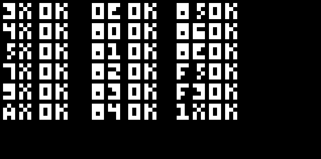

# BeginnerChip8
A simple CHIP-8 Interpreter created with C++
## How to run
```
g++ emulator.c -lSDL2 -lSDL2main -lSDL2_image
./a.out
```
## Resources and Guides
- https://multigesture.net/articles/how-to-write-an-emulator-chip-8-interpreter/
- https://tobiasvl.github.io/blog/write-a-chip-8-emulator/
- http://devernay.free.fr/hacks/chip8/C8TECH10.HTM
## test-rom Result

